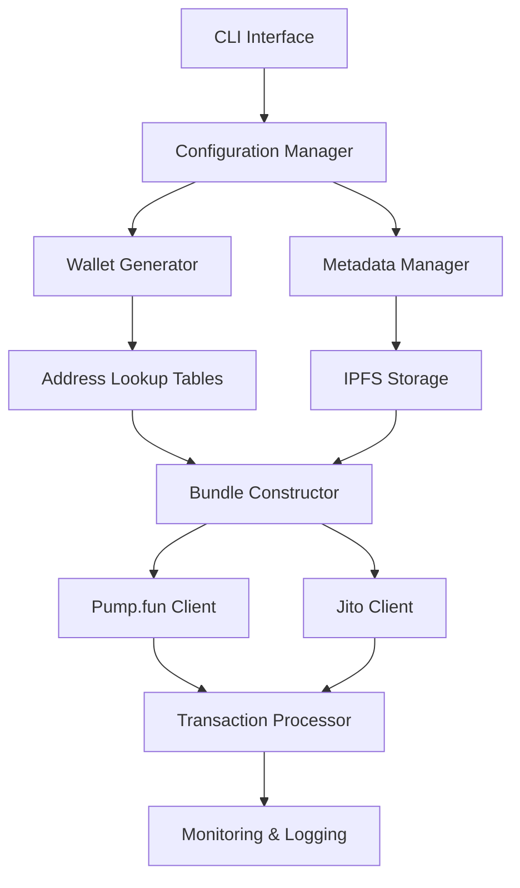

## Функциональные требования

### Основной сценарий использования

1. **Подготовка**: Генерация множественных кошельков и настройка метаданных токена
2. **Создание токена**: Деплой токена на Pump.fun с начальной ликвидностью
3. **Bundle покупки**: Одновременные покупки от 4-16 сгенерированных кошельков
4. **Опциональная продажа**: Продажа токенов через Pump.fun или миграция на Raydium

### Технические возможности

- **Масштабируемость**: Поддержка до 16 покупательских кошельков в одном bundle
- **Гибкость**: Настраиваемые объемы покупок и распределение SOL
- **Надежность**: Использование Address Lookup Tables для оптимизации транзакций
- **Мониторинг**: Отслеживание статуса bundle и баланс кошельков

---

## Архитектурный обзор

### Высокоуровневая схема

### Ключевые компоненты

| Компонент                    | Ответственность                                  | Статус |
| ---------------------------- | ------------------------------------------------ | ------ |
| **Wallet Management**        | Генерация и управление множественными кошельками | 1      |
| **Pump.fun Integration**     | Взаимодействие с IDL контракта                   | 1      |
| **Jito Bundle Client**       | Отправка bundle через Block Engine               | 1      |
| **Metadata Storage**         | Загрузка изображений и метаданных в IPFS         | 2      |
| **Transaction Optimization** | Использование LUT для минимизации размера        | 2      |

---

## Технические ограничения

### Блокчейн ограничения
- **Размер транзакции**: Максимум 1232 байта на транзакцию
- **Bundle лимиты**: До 5 транзакций в одном Jito bundle
- **Gas оптимизация**: Использование Address Lookup Tables обязательно

### Интеграционные зависимости
- **Jito Block Engine**: Требует авторизацию через keypair
- **Pump.fun Contract**: Зависимость от стабильности IDL
- **IPFS Provider**: ==Pinata== или аналогич

---

## Нефункциональные требования

### Производительность
==хуй==

### Надежность
- **Обработка ошибок**: Автоматические retry для временных сбоев
- **Валидация данных**: Проверка балансов и настроек перед запуском
- **Логирование**: Детальные логи всех операций для отладки ==(>прометеус)==

### Безопасность
==//////==

---

## Области применения

### MVP функциональность
- [ ] Создание токена на Pump.fun
- [ ] Bundle покупки через Jito
- [ ] Базовый мониторинг результатов
