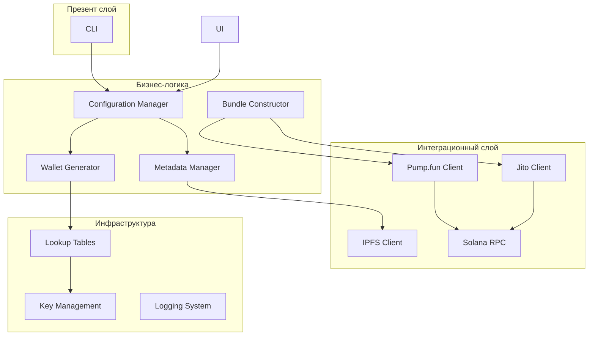
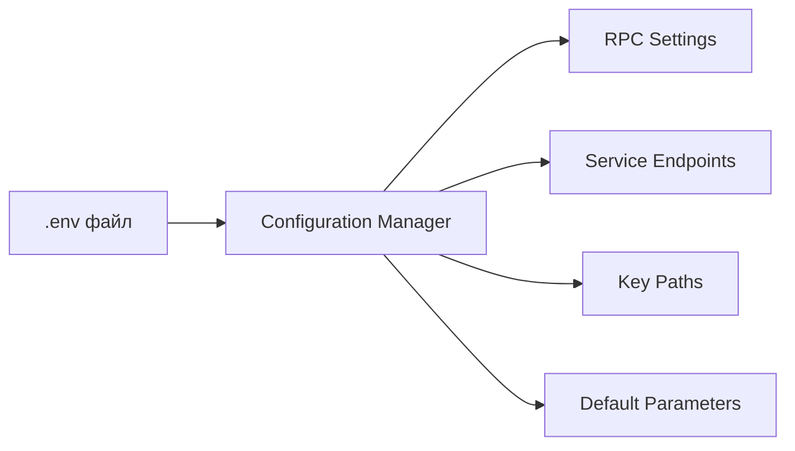
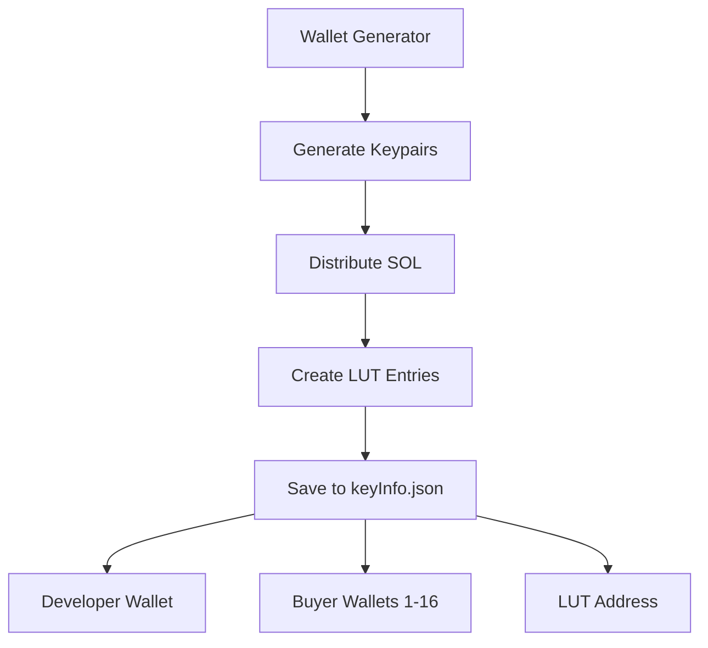
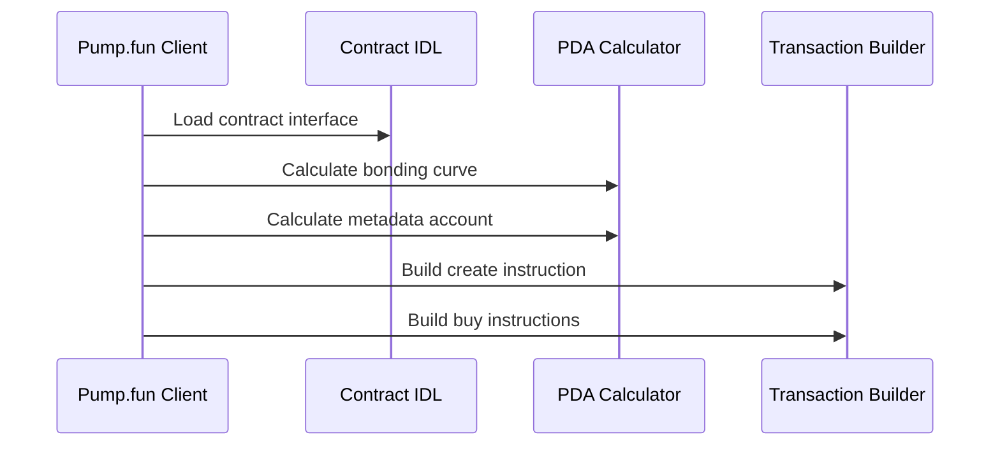
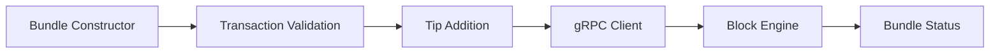
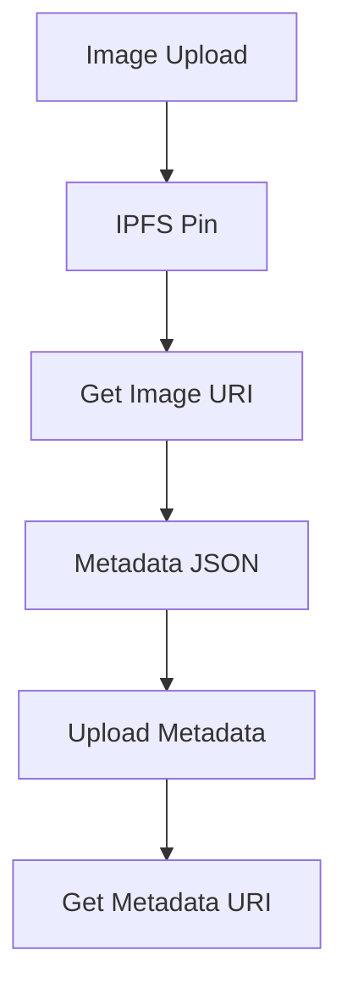
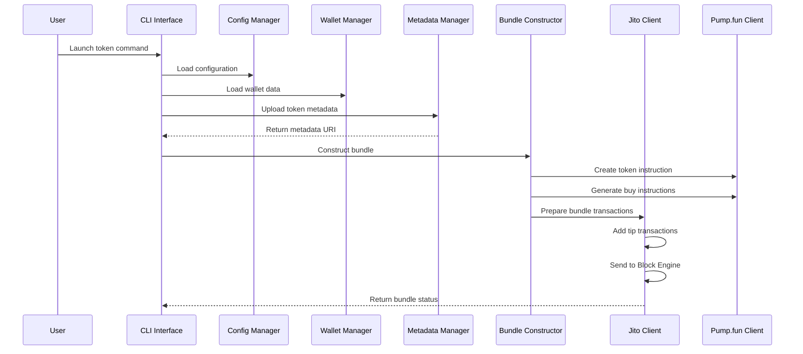
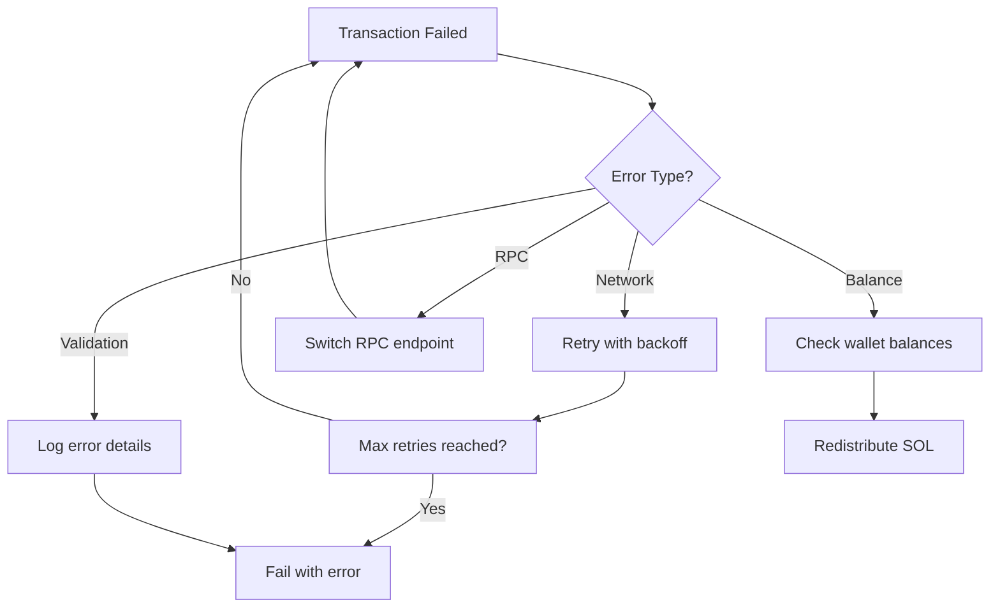

## ==Модульная структура==

---

## Детализация модулей

### Configuration Manager
**Назначение**: Централизованное управление настройками и константами

**Ключевые константы**:
- Pump.fun программы и аккаунты
- Jito Block Engine эндпоинты
- RPC провайдеры и fallback URLs
- Настройки таймаутов и retry логики

### Wallet Management System
**Назначение**: Генерация и управление множественными кошельками

**Структура данных**:
- Основной кошелек разработчика
- 16 покупательских кошелька с индивидуальными балансами
- Address Lookup Table для оптимизации транзакций
- Планы покупок и распределение объемов

### Pump.fun Integration Layer
**Назначение**: Взаимодействие с Pump.fun смарт-контрактом

**Функциональность**:
- Загрузка и парсинг IDL контракта
- Вычисление Program Derived Addresses (PDA)
- Построение инструкций создания и покупки токенов
- Интеграция с Anchor framework

### Jito Bundle Engine
**Назначение**: Отправка bundle транзакций через Jito Block Engine

**Аспекты**:
- Авторизация через keypair
- Добавление tip транзакций для приоритизации
- Мониторинг статуса bundle выполнения
- Обработка ошибок и retry механизмы

### Metadata Management
**Назначение**: Загрузка метаданных токена в IPFS

**Интеграции**:
- Pinata IPFS для загрузки изображений
- Формирование JSON метаданных по стандарту SPL Token
- Валидация размеров и форматов файлов

---

## Потоки данных

### Основной поток создания токена

### Поток обработки ошибок

## Связанные документы

- [[01-Техническое-задание]] - Общие требования
- [[03-Процессы-и-алгоритмы]] - Детальная логика работы
- [[Архитектурные-диаграммы]] - Визуальные схемы
- [[Схемы-данных]] - Форматы и структуры
