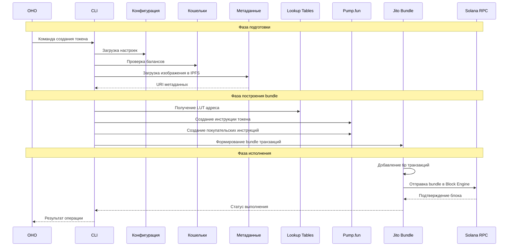
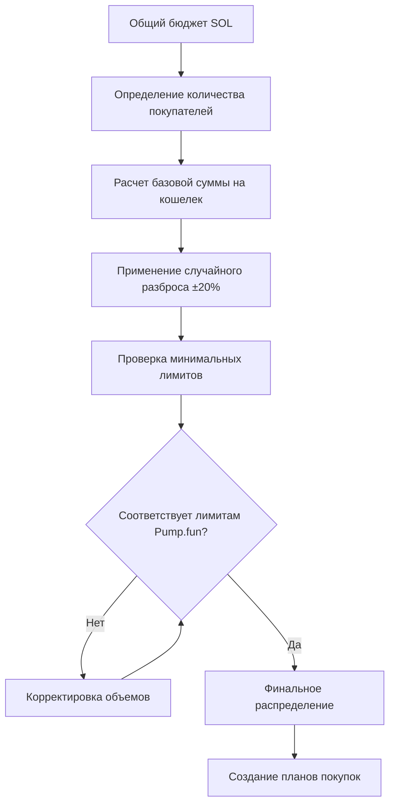
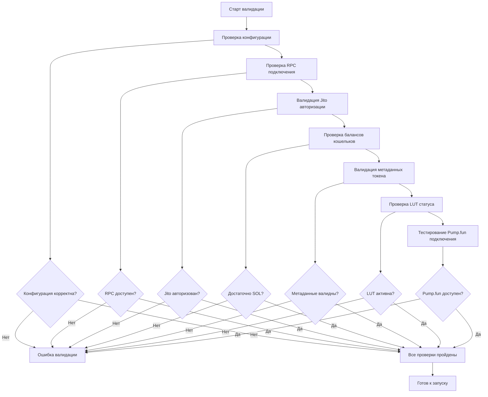
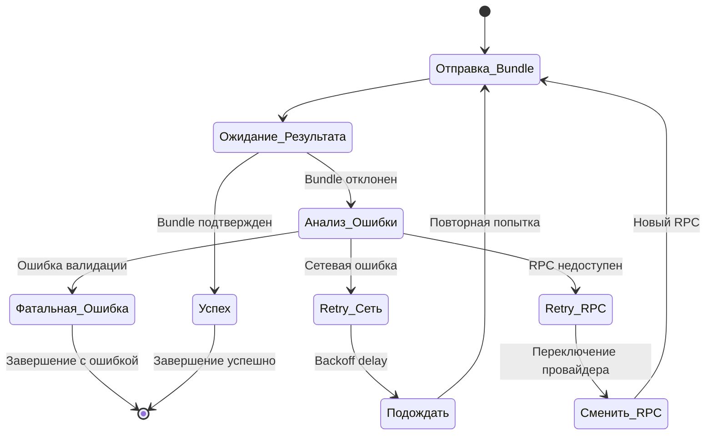
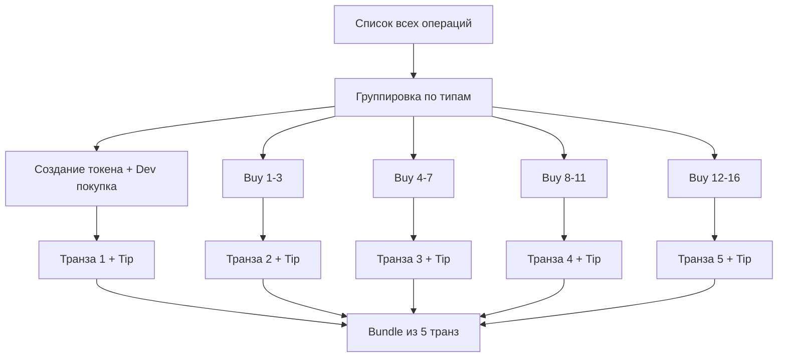

## Основные процессы системы

### 1. Алгоритм создания токена с bundle покупками

Это главный процесс системы, который объединяет создание токена и массовые покупки в одном блоке.

### 2. Алгоритм распределения покупок

Стратегическое распределение покупательской нагрузки между кошельками.

**Формула расчета**:
$$
\text{Сумма на кошелек} = \frac{\text{Общий бюджет}}{n} \times (1 + \text{random}(-0.2, 0.2))
$$

Где:
- $n$ = количество покупательских кошельков (5-16)
- $\text{random}(-0.2, 0.2)$ = случайное отклонение ±20%

### 4. Процесс валидации перед запуском

Комплексная проверка готовности системы к запуску bundle.

### 5. Алгоритм обработки ошибок bundle

Система восстановления после сбоев.

**Параметры retry логики**:
- Максимум попыток: 3
- Backoff delay: 2^n с
- Таймаут ожидания: 3000 

---

### Bundle Construction Algorithm

- Base Fee = стандартная комиссия сети (~5000 lamports)
- Priority Fee = дополнительная плата за приоритет (~10000 lamports)
- Jito Tip = чаевые для Block Engine (~100000 lamports)

---

## Криты

### 1. Timing Dependencies
- **LUT активация**: Требует подтверждения в блокчейне перед использованием
- **Metadata доступность**: IPFS должен успеть распространить файлы
- **Bundle координация**: Все транзакции должны быть готовы одновременно

### 2. Resource Management
- **SOL распределение**: Точный расчет необходимых балансов
- **RPC лимиты**: Контроль количества запросов к провайдеру
- **Memory usage**: Оптимизация работы с большими данными

### 3. Error Recovery Points
- **Pre-validation**: Проверка всех условий перед стартом
- **Mid-process checkpoints**: Возможность восстановления с промежуточной точки
- **Post-execution cleanup**: Освобождение ресурсов после завершения

