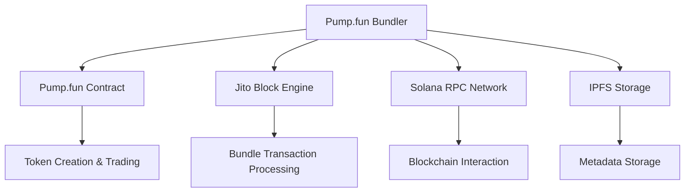
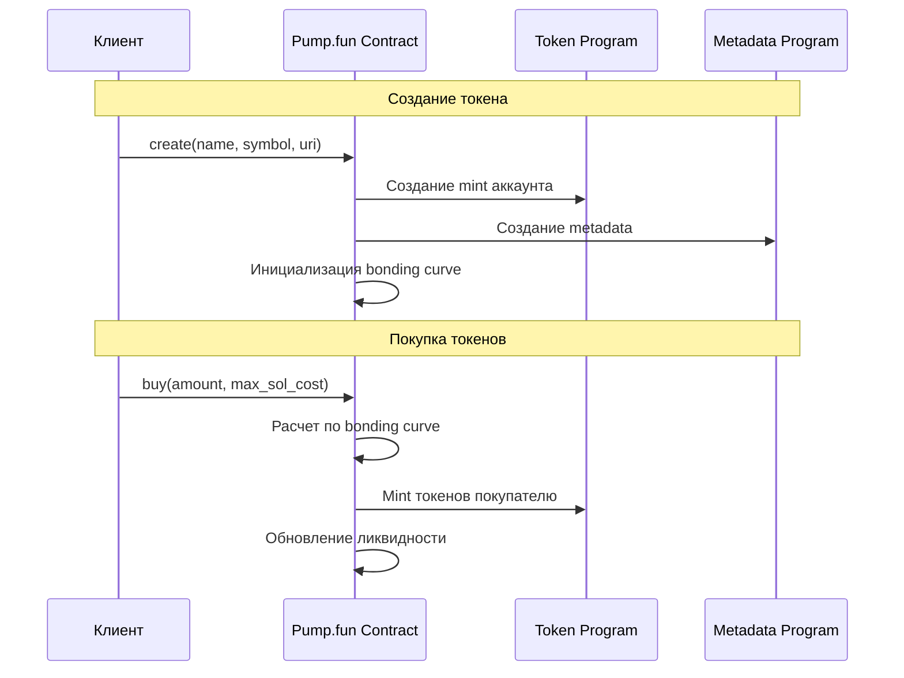
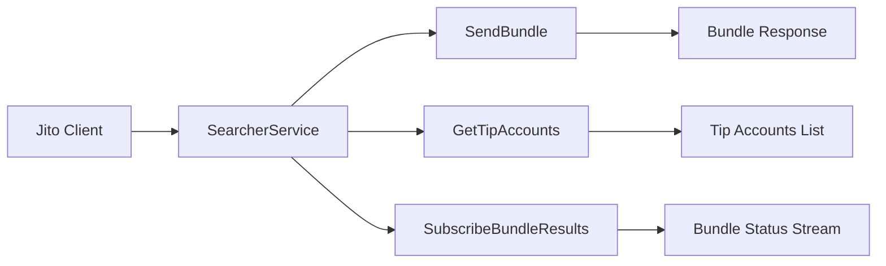
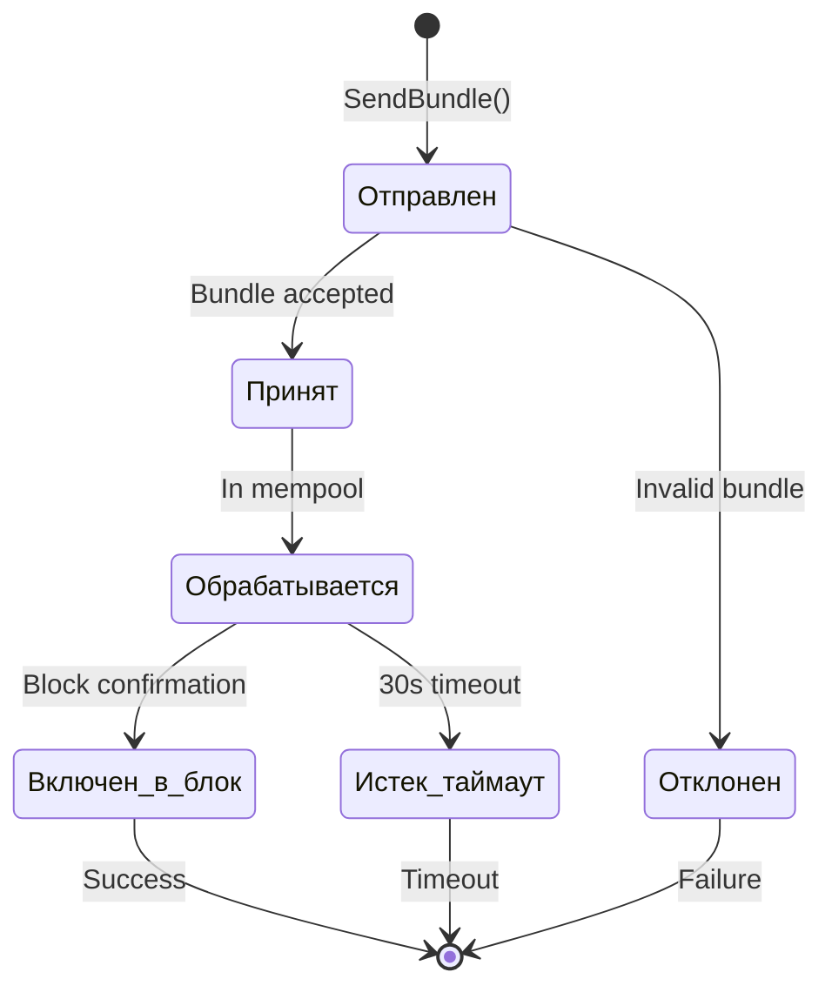
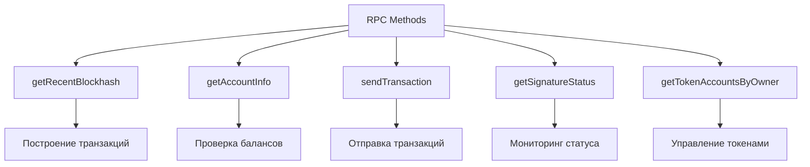
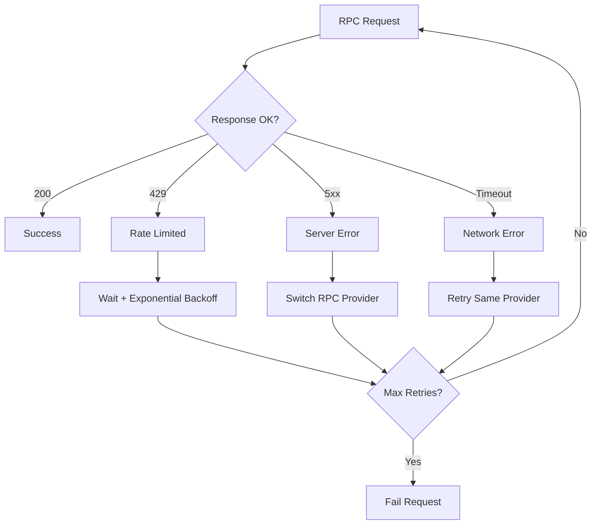
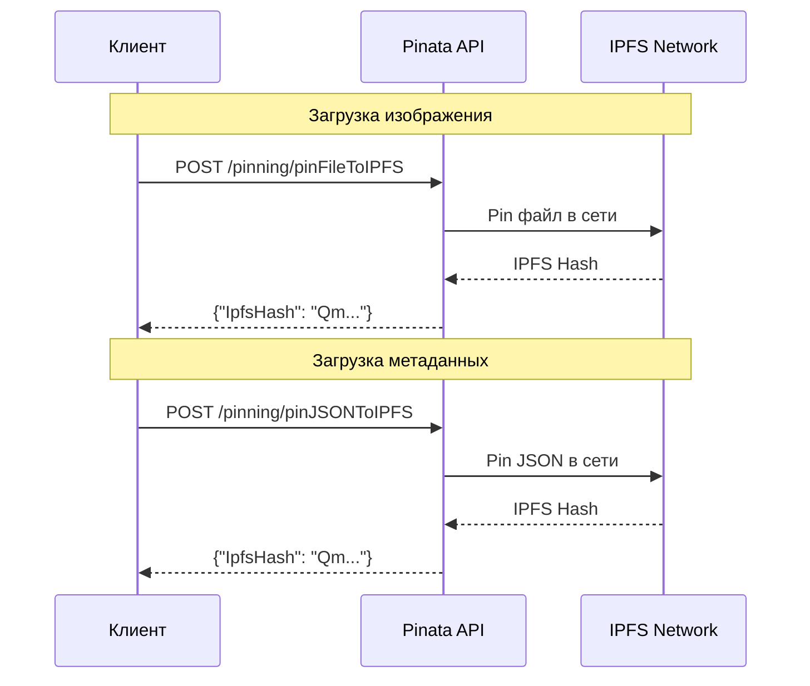
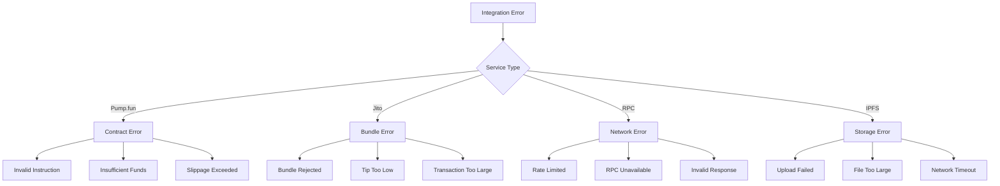

# Спецификации интеграций - Внешние сервисы

## Интеграции




---

## Интеграция с Pump.fun

**Контракт**: `6EF8rrecthR5Dkzon8Nwu78hRvfCKubJ14M5uBEwF6P`
**Тип интеграции**: IDL-based Anchor интеграция ==(проверить файл с гита)==

| Аккаунт | Адрес | Назначение |
|---------|-------|------------|
| **Program ID** | `6EF8rrecthR5Dkzon8Nwu78hRvfCKubJ14M5uBEwF6P` | Основной контракт |
| **Global** | `4wTV1YmiEkRvAtNtsSGPtUrqRYQMe5SKy2uB4Jjaxnjf` | Глобальные настройки |
| **Fee Recipient** | `CebN5WGQ4jvEPvsVU4EoHEpgzq1VV7AbicfhtW4xC9iM` | Получатель комиссий |
| **Mint Authority** | `TSLvdd1pWpHVjahSpsvCXUbgwsL3JAcvokwaKt1eokM` | Авторизация минтинга |

### ==Инструкции контракта==


### Лимиты и ограничения

- **Минимальная покупка**: 0.000001 SOL (~100 lamports)
- **Максимальная покупка**: Ограничена ликвидностью bonding curve
- **Слипа**: Автоматический расчет в контракте


---

## Интеграция с Jito Block Engine

### Спецификация

**Эндпоинт**: `mainnet.block-engine.jito.wtf:443`
**Протокол**: gRPC (TLS)
**Аутентификация**: Ed25519 keypair 

### gRPC 



### Структура Bundle запроса

```protobuf
message SendBundleRequest {
  Bundle bundle = 1;
}

message Bundle {
  Header header = 1;
  repeated bytes transactions = 2;
}

message Header {
  uint64 tip = 1;
}
```

### Bundle ограничения

- **Максимум транзакций**: 5 в одном bundle
- **Максимальный размер**: 1232 байта на транзакцию
- **Минимальный tip**: 100,000 lamports (0.0001 SOL)
- **Таймаут**: 30 секунд на обработку

### Мониторинг статуса Bundle



---

## Интеграция с Solana RPC

### Провайдеры RPC

**Основные провайдеры**:
1. **Helius** - `https://mainnet.helius-rpc.com/?api-key={API_KEY}`
2. **QuickNode** - `https://solana-mainnet.quiknode.pro/{API_KEY}/`
3. **Alchemy** - `https://solana-mainnet.g.alchemy.com/v2/{API_KEY}`

**Запас**:
- `https://api.mainnet-beta.solana.com`
- `https://solana-api.projectserum.com`

### RPC методы



### Rate Limiting

| Провайдер | Requests/sec | Burst Limit | WebSocket |
|-----------|--------------|-------------|-----------|
| **Helius** | 100 | 1000 | Да |
| **QuickNode** | 50 | 500 | Да |
| **Alchemy** | 30 | 300 | Да |
| **Public** | 10 | 40 | Нет |

### Retry стратегия



---

## Интеграция с IPFS

### Провайдер: Pinata

**API Base URL**: `https://api.pinata.cloud`
**Аут: JWT в Authorization
Gateway**: `https://gateway.pinata.cloud/ipfs/{hash}`

### Ручки для загрузки



### Структура метаданных токена

```json
{
  "name": "Token Name",
  "symbol": "SYMBOL", 
  "description": "Token description",
  "image": "https://gateway.pinata.cloud/ipfs/{image_hash}",
  "external_url": "https://example.com",
  "attributes": [],
  "properties": {
    "files": [
      {
        "uri": "https://gateway.pinata.cloud/ipfs/{image_hash}",
        "type": "image/png"
      }
    ],
    "category": "image"
  }
}
```

### Лимиты Pinata

- **Размер файла**: До 100MB
- **Requests/месяц**: 1000 (free)
- **Bandwidth**: 1GB/месяц (free
- **Pin лимит**: 1000 файлов (free)

---

## Обработка ошибок интеграций

### Классификация ошибок



### Стратегии восстановления

| Тип ошибки | Действие | Retry | Timeout |
|------------|----------|-------|---------|
| **Rate Limit** | Exponential backoff | 3x | 60s |
| **Network** | Switch provider | 2x | 30s |
| **Validation** | Fix and retry | 1x | - |
| **Funds** | Stop execution | 0x | - |
