# План реализации и тестирования

## Roadmap разработки

Техническая дорожная карта разбита на четыре основных этапа с четкими критериями готовности и метриками успеха.

---

## Этап 1: Базовая инфраструктура

### Цели этапа
Создание фундаментальных компонентов для управления конфигурацией, кошельками и оптимизацией транзакций.

### Критерии готовности

### Ключевые модули

**1. Configuration System**
- Централизованное управление настройками
- Поддержка multiple RPC провайдеров
- Валидация критических параметров

**2. Wallet Management**
- Автоматическая генерация keypairs
- SOL распределение между кошельками
- Безопасное хранение приватных ключей

**3. Address Lookup Tables**
- Создание и управление LUT
- Оптимизация размера транзакций
- Интеграция с Solana RPC

### Тестирование Этапа 1

| Тест                 | Описание                       | Критерий успеха             |
| -------------------- | ------------------------------ | --------------------------- |
| **Config Load**      | Загрузка всех настроек         | Нет ошибок валидации        |
| **Wallet Gen**       | Создание 16 кошельков          | Все ключи сгенерированы     |
| **SOL Distribution** | Распределение между кошельками | Балансы соответствуют плану |
| **LUT Creation**     | Создание lookup table          | LUT активна в сети          |

---

## Этап 2: Внешние интеграции

### Цели этапа
Реализация интеграций со всеми внешними сервисами: Solana RPC, IPFS, Pump.fun контрактом.

### Архитектура интеграций

### Pump.fun Contract Integration

**Фокус**: IDL-based интеграция с Anchor framework

**Ключевые инструкции**:
- `create`: Создание нового токена
- `buy`: Покупка токенов через bonding curve
- `sell`: Продажа токенов обратно в пул

### Критерии готовности Этапа 2

- [ ] RPC клиент с fallback логикой
- [ ] IPFS загрузка изображений и метаданных
- [x] Pump.fun IDL интеграция
- [ ] PDA вычисления (bonding curve, metadata)
- [x] Валидация всех внешних зависимостей

---

## Этап 3: Jito Bundle Engine

### Цели этапа
Реализация критически важной интеграции с Jito Block Engine для bundle функциональности.

### Bundle Architecture

### Bundle Composition Strategy

**Стратегия группировки транзакций**:

1. **Transaction 1**: Token Creation + Developer Buy + Tip
2. **Transaction 2-5**: Grouped Buyer Purchases (5 wallets each) + Tips

### Критерии готовности Этапа 3

- [ ] gRPC клиент подключение к Jito
- [ ] Bundle конструктор с оптимизацией
- [ ] Tip система для приоритизации
- [ ] Мониторинг статуса bundle
- [ ] Error handling и retry логика

---

## Этап 4: Интеграция и тестирование

### End-to-End Testing

Комплексное тестирование всей системы в условиях, максимально приближенных к production.

```mermaid
flowchart TD
    A[Start E2E Test] --> B[Environment Setup]
    B --> C[Wallet Funding]
    C --> D[LUT Activation]
    D --> E[Metadata Upload]
    E --> F[Bundle Construction]
    F --> G[Jito Submission]
    G --> H[Result Verification]
    H --> I[Cleanup]
    
    B --> B1[Load Test Config]
    C --> C1[Distribute Test SOL]
    D --> D2[Verify LUT Status]
    E --> E1[Upload Test Image to IPFS]
    F --> F1[Build All Instructions]
    G --> G1[Submit to Block Engine]
    H --> H1[Check Token Creation]
    H --> H2[Verify All Purchases]
    I --> I1[Clean Test Data]
```

### Тестовые сценарии

| Сценарий               | Описание                    | Критерий успеха           |
| ---------------------- | --------------------------- | ------------------------- |
| **Happy Path**         | Полный цикл создания токена | Bundle успешно выполнен   |
| **Network Failure**    | RPC недоступен              | Fallback на резервный RPC |
| **Bundle Rejection**   | Jito отклоняет bundle       | Retry с увеличенным tip   |
| **Insufficient Funds** | Недостаток SOL              | Корректная ошибка         |
| **Large Bundle**       | Максимальная нагрузка       | Все 16 кошелька в bundle  |
|                        |                             |                           |
|                        |                             |                           |
|                        |                             |                           |
|                        |                             |                           |

### Метрики производительности

---

## Production Deployment

### Окружения развертывания

### Критерии готовности к Production

**Функциональные требования**:
- ✅ Все E2E тесты проходят
- ✅ Performance метрики соответствуют SLA
- ✅ Error handling покрывает все known cases
- ✅ Monitoring и логирование настроены

**Операционные требования**:
- ✅ Конфигурация вынесена в environment
- ✅ Secrets management настроен
- ✅ Backup стратегия для ключей определена
- ✅ Rollback процедуры документированы

### Мониторинг в Production

---

## Риски и митигации

### Технические риски

| Риск | Вероятность | Воздействие | Митигация |
|------|-------------|-------------|-----------|
| **Jito API изменения** | Средняя | Высокое | Версионирование API, monitoring |
| **Pump.fun contract update** | Низкая | Критическое | IDL версии, тестирование |
| **RPC rate limiting** | Высокая | Среднее | Multiple providers, backoff |
| **Network congestion** | Высокая | Среднее | Dynamic fees, tip optimization |

### Бизнес риски

| Риск | Вероятность | Воздействие | Митигация |
|------|-------------|-------------|-----------|
| **MEV конкуренция** | Высокая | Среднее | Jito tips, timing optimization |
| **Слипаж потери** | Средняя | Среднее | Slippage limits, monitoring |
| **Регуляторные изменения** | Низкая | Высокое | Compliance monitoring |

