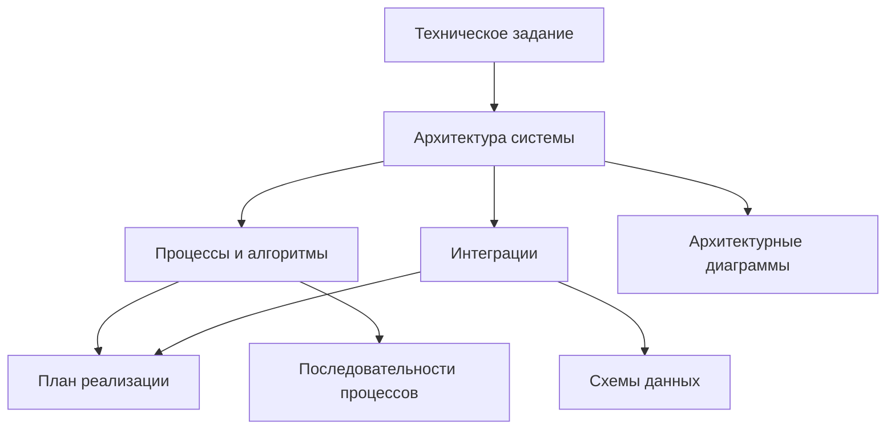

## Навигация по документации

### Основные документы
- [[01-Техническое-задание]] - Цели проекта и архитектурный обзор
- [[02-Архитектура-системы]] - Модульная структура и компоненты
- [[03-Процессы-и-алгоритмы]] - Детальная логика работы
- [[04-Интеграции]] - Спецификации внешних сервисов
- [[05-План-реализации]] - Roadmap разработки

### Диаграммы и схемы
- [[Архитектурные-диаграммы]] - Визуализация системы
- [[Последовательности-процессов]] - Flow диаграммы
- [[Схемы-данных]] - Структуры и форматы

---

## Граф связей проекта

---

*Документация создана: 7 сентября 2025*
*Версия: 1.0*